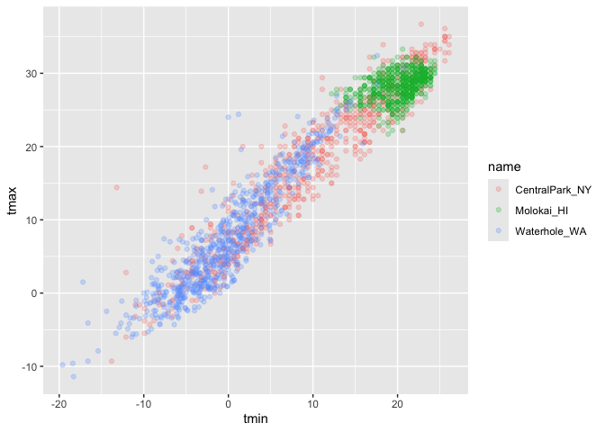
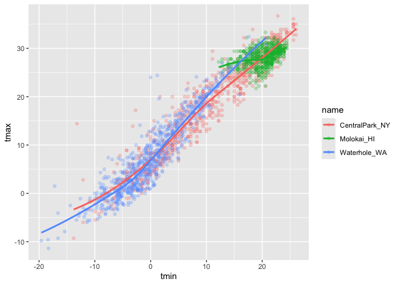
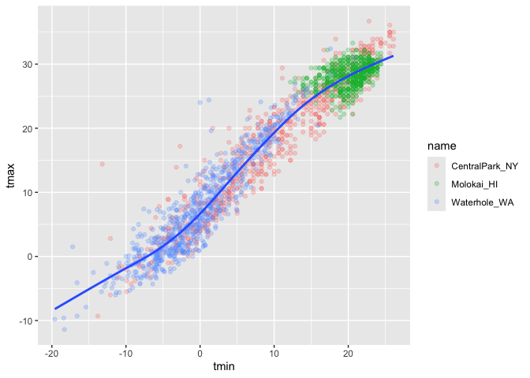
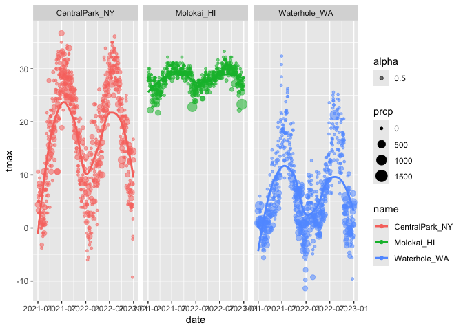
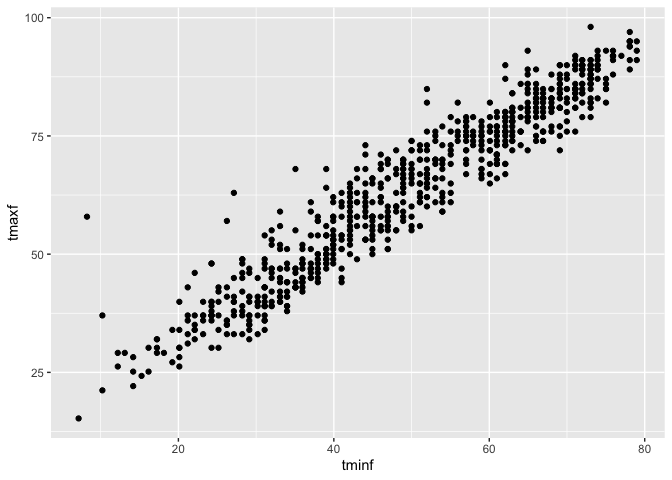

Visualization
================
Sameera
2026-10-01

``` r
library(tidyverse)
```

    ## ── Attaching core tidyverse packages ──────────────────────── tidyverse 2.0.0 ──
    ## ✔ dplyr     1.2.1     ✔ readr     2.2.0
    ## ✔ forcats   1.0.1     ✔ stringr   1.6.0
    ## ✔ ggplot2   4.0.3     ✔ tibble    3.3.1
    ## ✔ lubridate 1.9.5     ✔ tidyr     1.3.2
    ## ✔ purrr     1.2.2     
    ## ── Conflicts ────────────────────────────────────────── tidyverse_conflicts() ──
    ## ✖ dplyr::filter() masks stats::filter()
    ## ✖ dplyr::lag()    masks stats::lag()
    ## ℹ Use the conflicted package (<http://conflicted.r-lib.org/>) to force all conflicts to become errors

``` r
library(ggridges)

library(p8105.datasets)
data("weather_df")
```

Scatterplot

``` r
ggplot(weather_df, aes(x = tmin, y= tmax))
```

<!-- -->

``` r
ggplot(weather_df, aes(x = tmin, y= tmax)) +
  geom_point()
```

    ## Warning: Removed 17 rows containing missing values or values outside the scale range
    ## (`geom_point()`).

<!-- -->

Another way to do it where u put the dataframe first and

``` r
weather_df |> 
  ggplot(aes(x = tmin, y = tmax)) +
  geom_point()
```

    ## Warning: Removed 17 rows containing missing values or values outside the scale range
    ## (`geom_point()`).

<!-- -->

Making it fancier

``` r
weather_df |> 
  ggplot(aes(x = tmin, y = tmax, colour = name)) +
  geom_point(alpha = .25) ##for blending
```

    ## Warning: Removed 17 rows containing missing values or values outside the scale range
    ## (`geom_point()`).

<!-- -->

``` r
weather_df |> 
  ggplot(aes(x = tmin, y = tmax, colour = name)) +
  geom_point(alpha = .25) + ##for blending
  geom_smooth(se = FALSE) ## gives smooth curve and se false removes standard error shading
```

    ## `geom_smooth()` using method = 'loess' and formula = 'y ~ x'

    ## Warning: Removed 17 rows containing non-finite outside the scale range
    ## (`stat_smooth()`).

    ## Warning: Removed 17 rows containing missing values or values outside the scale range
    ## (`geom_point()`).

<!-- -->

where u defind your aesthetic matters

``` r
weather_df |> 
  ggplot(aes(x = tmin, y = tmax)) +
  geom_point(aes(colour = name), alpha = .25) + ##for blending
  geom_smooth(se = FALSE) ## gives smooth curve and se false removes standard error shading
```

    ## `geom_smooth()` using method = 'gam' and formula = 'y ~ s(x, bs = "cs")'

    ## Warning: Removed 17 rows containing non-finite outside the scale range
    ## (`stat_smooth()`).

    ## Warning: Removed 17 rows containing missing values or values outside the scale range
    ## (`geom_point()`).

<!-- -->

Show faceting

``` r
weather_df |> 
  ggplot(aes(x = tmin, y= tmax, colour = name)) +
  geom_point(alpha = .5) +
  facet_grid(. ~ name) ##separates the diff graphs 
```

    ## Warning: Removed 17 rows containing missing values or values outside the scale range
    ## (`geom_point()`).

<!-- --> by column or
row depending on where u put the dot

``` r
weather_df |> 
  ggplot(aes(x = tmin, y= tmax, colour = name)) +
  geom_point(alpha = .5) +
  facet_grid(name ~ .) ##separates the diff graphs 
```

    ## Warning: Removed 17 rows containing missing values or values outside the scale range
    ## (`geom_point()`).

<!-- -->

another way to do it

``` r
weather_df |> 
  ggplot(aes(x = tmin, y= tmax, colour = name)) +
  geom_point(alpha = .5) +
  facet_grid(cols = vars(name)) ##separates the diff graphs 
```

    ## Warning: Removed 17 rows containing missing values or values outside the scale range
    ## (`geom_point()`).

<!-- -->

Moving on from temp

``` r
weather_df |> 
  ggplot(aes(x = date, y = tmax, colour = name)) +
  geom_point(aes(size = prcp, alpha = .5)) + ## changes point size based on precipitation
  geom_smooth(se = FALSE) +
  facet_grid(. ~ name)
```

    ## `geom_smooth()` using method = 'loess' and formula = 'y ~ x'

    ## Warning: Removed 17 rows containing non-finite outside the scale range
    ## (`stat_smooth()`).

    ## Warning: Removed 19 rows containing missing values or values outside the scale range
    ## (`geom_point()`).

<!-- -->

plot only central park tmin and tmax and convert temp to fahrenheit

``` r
weather_df |> 
  filter(name == "CentralPark_NY") |> 
  mutate(tminf = tmin * 1.8 + 32, 
         tmaxf = tmax * 1.8 + 32) |> 
  ggplot(aes(x = tminf, y = tmaxf)) +
  geom_point()
```

<!-- -->
