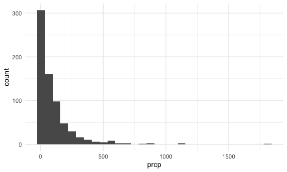
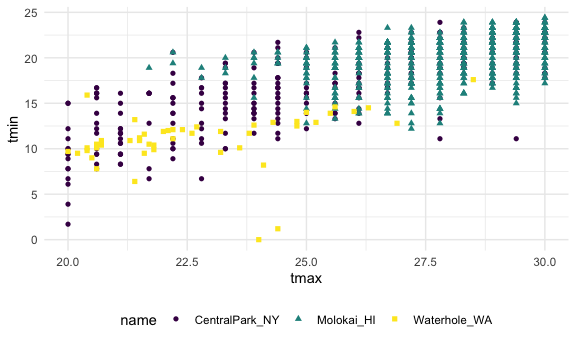
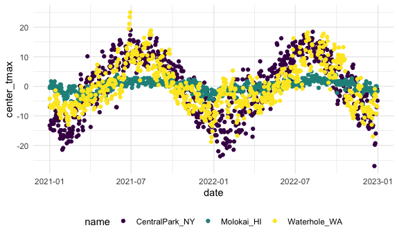

Numerical EDA
================
Sameera
2026-10-06

Load the weather data as well.

``` r
data("weather_df")

weather_df = 
  weather_df |> 
  mutate(
    month = lubridate::floor_date(date, unit = "month")
  )
```

Now we have everything we need!

``` r
weather_df |> 
  filter(prcp > 0) |> 
  ggplot(aes(x = prcp)) + 
  geom_histogram()
```

    ## `stat_bin()` using `bins = 30`. Pick better value `binwidth`.



wait, what?

``` r
weather_df |> 
  filter(prcp > 1000)
```

    ## # A tibble: 3 × 7
    ##   name           id          date        prcp  tmax  tmin month     
    ##   <chr>          <chr>       <date>     <dbl> <dbl> <dbl> <date>    
    ## 1 CentralPark_NY USW00094728 2021-08-21  1130  27.8  22.8 2021-08-01
    ## 2 CentralPark_NY USW00094728 2021-09-01  1811  25.6  17.2 2021-09-01
    ## 3 Molokai_HI     USW00022534 2022-12-18  1120  23.3  18.9 2022-12-01

``` r
weather_df |> 
  filter(tmax >= 20, tmax <= 30) |> 
  ggplot(aes(x = tmax, y = tmin, color = name, shape = name)) + 
  geom_point()
```



## `group_by()`

add some groups!

``` r
weather_df |> 
  group_by(name, month)
```

    ## # A tibble: 2,190 × 7
    ## # Groups:   name, month [72]
    ##    name           id          date        prcp  tmax  tmin month     
    ##    <chr>          <chr>       <date>     <dbl> <dbl> <dbl> <date>    
    ##  1 CentralPark_NY USW00094728 2021-01-01   157   4.4   0.6 2021-01-01
    ##  2 CentralPark_NY USW00094728 2021-01-02    13  10.6   2.2 2021-01-01
    ##  3 CentralPark_NY USW00094728 2021-01-03    56   3.3   1.1 2021-01-01
    ##  4 CentralPark_NY USW00094728 2021-01-04     5   6.1   1.7 2021-01-01
    ##  5 CentralPark_NY USW00094728 2021-01-05     0   5.6   2.2 2021-01-01
    ##  6 CentralPark_NY USW00094728 2021-01-06     0   5     1.1 2021-01-01
    ##  7 CentralPark_NY USW00094728 2021-01-07     0   5    -1   2021-01-01
    ##  8 CentralPark_NY USW00094728 2021-01-08     0   2.8  -2.7 2021-01-01
    ##  9 CentralPark_NY USW00094728 2021-01-09     0   2.8  -4.3 2021-01-01
    ## 10 CentralPark_NY USW00094728 2021-01-10     0   5    -1.6 2021-01-01
    ## # ℹ 2,180 more rows

## `summarize()`

``` r
weather_df |> 
  group_by(name) |> 
  summarize(count = n())
```

    ## # A tibble: 3 × 2
    ##   name           count
    ##   <chr>          <int>
    ## 1 CentralPark_NY   730
    ## 2 Molokai_HI       730
    ## 3 Waterhole_WA     730

``` r
weather_df |> 
  group_by(name, month) |> 
  summarize(count = n())
```

    ## `summarise()` has regrouped the output.
    ## ℹ Summaries were computed grouped by name and month.
    ## ℹ Output is grouped by name.
    ## ℹ Use `summarise(.groups = "drop_last")` to silence this message.
    ## ℹ Use `summarise(.by = c(name, month))` for per-operation grouping
    ##   (`?dplyr::dplyr_by`) instead.

    ## # A tibble: 72 × 3
    ## # Groups:   name [3]
    ##    name           month      count
    ##    <chr>          <date>     <int>
    ##  1 CentralPark_NY 2021-01-01    31
    ##  2 CentralPark_NY 2021-02-01    28
    ##  3 CentralPark_NY 2021-03-01    31
    ##  4 CentralPark_NY 2021-04-01    30
    ##  5 CentralPark_NY 2021-05-01    31
    ##  6 CentralPark_NY 2021-06-01    30
    ##  7 CentralPark_NY 2021-07-01    31
    ##  8 CentralPark_NY 2021-08-01    31
    ##  9 CentralPark_NY 2021-09-01    30
    ## 10 CentralPark_NY 2021-10-01    31
    ## # ℹ 62 more rows

``` r
weather_df |> 
  count(name, month)
```

    ## # A tibble: 72 × 3
    ##    name           month          n
    ##    <chr>          <date>     <int>
    ##  1 CentralPark_NY 2021-01-01    31
    ##  2 CentralPark_NY 2021-02-01    28
    ##  3 CentralPark_NY 2021-03-01    31
    ##  4 CentralPark_NY 2021-04-01    30
    ##  5 CentralPark_NY 2021-05-01    31
    ##  6 CentralPark_NY 2021-06-01    30
    ##  7 CentralPark_NY 2021-07-01    31
    ##  8 CentralPark_NY 2021-08-01    31
    ##  9 CentralPark_NY 2021-09-01    30
    ## 10 CentralPark_NY 2021-10-01    31
    ## # ℹ 62 more rows

``` r
weather_df |> 
  group_by(month) |> 
  summarize(
    count = n(),
    n_days = n_distinct(date))
```

    ## # A tibble: 24 × 3
    ##    month      count n_days
    ##    <date>     <int>  <int>
    ##  1 2021-01-01    93     31
    ##  2 2021-02-01    84     28
    ##  3 2021-03-01    93     31
    ##  4 2021-04-01    90     30
    ##  5 2021-05-01    93     31
    ##  6 2021-06-01    90     30
    ##  7 2021-07-01    93     31
    ##  8 2021-08-01    93     31
    ##  9 2021-09-01    90     30
    ## 10 2021-10-01    93     31
    ## # ℹ 14 more rows

DON’T DO THIS

``` r
weather_df |> 
  pull(tmax) |> 
  summary()
```

do this instead

``` r
weather_df |> 
  group_by(name) |> 
  summarize(
    n = n(),
    mean_tmax = mean(tmax, na.rm = TRUE),
    median_tmax = median(tmax, na.rm = TRUE),
    q95_prcp = quantile(prcp, 0.95, na.rm = TRUE)
  ) |> 
  knitr::kable(digits = 2)
```

| name           |   n | mean_tmax | median_tmax | q95_prcp |
|:---------------|----:|----------:|------------:|---------:|
| CentralPark_NY | 730 |     17.66 |        18.9 |      198 |
| Molokai_HI     | 730 |     28.32 |        28.3 |       41 |
| Waterhole_WA   | 730 |      7.38 |         6.1 |      279 |

``` r
weather_df |> 
  group_by(name, month) |> 
  summarise(
    mean_tmax = mean(tmax, na.rm = TRUE)
  ) |> 
  pivot_wider(
    names_from = name, 
    values_from = mean_tmax
  ) |> 
  knitr::kable(digits = 2)
```

    ## `summarise()` has regrouped the output.
    ## ℹ Summaries were computed grouped by name and month.
    ## ℹ Output is grouped by name.
    ## ℹ Use `summarise(.groups = "drop_last")` to silence this message.
    ## ℹ Use `summarise(.by = c(name, month))` for per-operation grouping
    ##   (`?dplyr::dplyr_by`) instead.

| month      | CentralPark_NY | Molokai_HI | Waterhole_WA |
|:-----------|---------------:|-----------:|-------------:|
| 2021-01-01 |           4.27 |      27.62 |         0.80 |
| 2021-02-01 |           3.87 |      26.37 |        -0.79 |
| 2021-03-01 |          12.29 |      25.86 |         2.62 |
| 2021-04-01 |          17.61 |      26.57 |         6.10 |
| 2021-05-01 |          22.08 |      28.58 |         8.20 |
| 2021-06-01 |          28.06 |      29.59 |        15.25 |
| 2021-07-01 |          28.35 |      29.99 |        17.34 |
| 2021-08-01 |          28.81 |      29.52 |        17.15 |
| 2021-09-01 |          24.79 |      29.67 |        12.65 |
| 2021-10-01 |          19.93 |      29.13 |         5.48 |
| 2021-11-01 |          11.54 |      28.85 |         3.53 |
| 2021-12-01 |           9.59 |      26.19 |        -2.10 |
| 2022-01-01 |           2.85 |      26.61 |         3.61 |
| 2022-02-01 |           7.65 |      26.83 |         2.99 |
| 2022-03-01 |          11.99 |      27.73 |         3.42 |
| 2022-04-01 |          15.81 |      27.72 |         2.46 |
| 2022-05-01 |          22.25 |      28.28 |         5.81 |
| 2022-06-01 |          26.09 |      29.16 |        11.13 |
| 2022-07-01 |          30.72 |      29.53 |        15.86 |
| 2022-08-01 |          30.50 |      30.70 |        18.83 |
| 2022-09-01 |          24.92 |      30.41 |        15.21 |
| 2022-10-01 |          17.43 |      29.22 |        11.88 |
| 2022-11-01 |          14.02 |      27.96 |         2.14 |
| 2022-12-01 |           6.76 |      27.35 |        -0.46 |

what about looking at this

``` r
weather_df |> 
  group_by(name, month) |> 
  summarise(
    mean_tmax = mean(tmax, na.rm = TRUE)
  ) |> 
  ggplot(aes(x = month, y = mean_tmax, color = name)) + 
  geom_point() + 
  geom_line()
```

    ## `summarise()` has regrouped the output.
    ## ℹ Summaries were computed grouped by name and month.
    ## ℹ Output is grouped by name.
    ## ℹ Use `summarise(.groups = "drop_last")` to silence this message.
    ## ℹ Use `summarise(.by = c(name, month))` for per-operation grouping
    ##   (`?dplyr::dplyr_by`) instead.


``` r
weather_df |> 
  group_by(name) |> 
  mutate(center_tmax = tmax - mean(tmax, na.rm = TRUE)) |> 
  ggplot(aes(x = date, y = center_tmax, color = name)) +
  geom_point()
```

    ## Warning: Removed 17 rows containing missing values or values outside the scale range
    ## (`geom_point()`).



“window” functions

ranking things

``` r
weather_df |> 
  group_by(name, month) |> 
  mutate(temp_rank = min_rank(tmax)) |> 
  filter(temp_rank < 2)
```

    ## # A tibble: 92 × 8
    ## # Groups:   name, month [72]
    ##    name           id          date        prcp  tmax  tmin month      temp_rank
    ##    <chr>          <chr>       <date>     <dbl> <dbl> <dbl> <date>         <int>
    ##  1 CentralPark_NY USW00094728 2021-01-29     0  -3.8  -9.9 2021-01-01         1
    ##  2 CentralPark_NY USW00094728 2021-02-08     0  -1.6  -8.2 2021-02-01         1
    ##  3 CentralPark_NY USW00094728 2021-03-02     0   0.6  -6   2021-03-01         1
    ##  4 CentralPark_NY USW00094728 2021-04-02     0   3.9  -2.1 2021-04-01         1
    ##  5 CentralPark_NY USW00094728 2021-05-29   117  10.6   8.3 2021-05-01         1
    ##  6 CentralPark_NY USW00094728 2021-05-30   226  10.6   8.3 2021-05-01         1
    ##  7 CentralPark_NY USW00094728 2021-06-11     0  20.6  16.7 2021-06-01         1
    ##  8 CentralPark_NY USW00094728 2021-06-12     0  20.6  16.7 2021-06-01         1
    ##  9 CentralPark_NY USW00094728 2021-07-03    86  18.9  15   2021-07-01         1
    ## 10 CentralPark_NY USW00094728 2021-08-04     0  24.4  19.4 2021-08-01         1
    ## # ℹ 82 more rows
